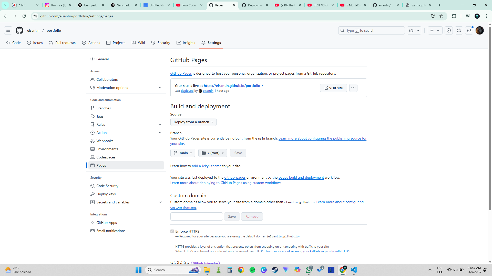

# Troubleshooting GitHub Pages Deployment

Follow these steps to troubleshoot your GitHub Pages deployment:

1.  **Verify GitHub Pages settings:**
    *   Go to your repository on GitHub.
    *   Click on "Settings".
    *   Scroll down to the "Pages" section in the left sidebar.
    *   Ensure that GitHub Pages is enabled.
    *   Confirm that the "Source" is set to:
        *   Branch: `main`
        *   Directory: `/ (root)`
    *   If you make any changes, click "Save".

2.  **Check for recent commits:**
    *   Make sure your latest changes have been committed and pushed to the `main` branch.
    *   You can verify this by looking at the commit history on GitHub.

3.  **Inspect GitHub Pages build status:**
    *   Click on "Environments" in your repository.
    *   Look for the "github-pages" environment.
    *   Check the status of the latest deployment. If it failed, click "View deployment" to see the build logs and identify any errors.

4.  **Clear browser cache:**
    *   Sometimes your browser might be showing an old cached version of the site.
    *   Try clearing your browser's cache and cookies, or try viewing the site in a different browser.

5.  **Check DNS settings (if using a custom domain):**
    *   If you are using a custom domain, verify that your DNS settings are correctly configured to point to GitHub Pages.
    *   The DNS records should point to GitHub's IP addresses. Refer to the GitHub Pages documentation for the correct IP addresses.

If you've followed these steps and your site is still not working, consider seeking help from the GitHub community or consulting the GitHub Pages documentation.